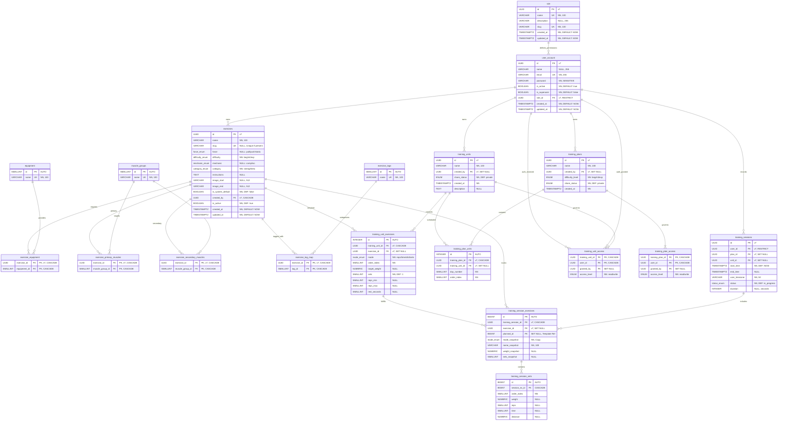

```mermaid
erDiagram
    %% ================================================================
    %% 1. USERS & ROLES
    %% ================================================================
    role ||--o{ user_account : "defines_permissions"

    role {
        UUID id PK "v7"
        VARCHAR name UK "NN, 100"
        VARCHAR description "NULL, 255"
        VARCHAR slug UK "NN, 100"
        TIMESTAMPTZ created_at "NN, DEFAULT: NOW"
        TIMESTAMPTZ updated_at "NN, DEFAULT: NOW"
    }

    user_account {
        UUID id PK "v7"
        VARCHAR name "NULL, 255"
        VARCHAR email UK "NN, 255"
        VARCHAR password "NN, SENSITIVE"
        BOOLEAN is_active "NN, DEFAULT: true"
        BOOLEAN is_superuser "NN, DEFAULT: false"
        UUID role_id FK "v7, RESTRICT"
        TIMESTAMPTZ created_at "NN, DEFAULT: NOW"
        TIMESTAMPTZ updated_at "NN, DEFAULT: NOW"
    }

    %% ================================================================
    %% 2. EXERCISES & CATALOG
    %% ================================================================
    user_account ||--o{ exercises : "owns"
    equipment ||--o{ exercise_equipment : "provides"
    exercises ||--o{ exercise_equipment : "requires"
    muscle_groups ||--o{ exercise_primary_muscles : "targets"
    exercises ||--o{ exercise_primary_muscles : "primary"
    muscle_groups ||--o{ exercise_secondary_muscles : "assists"
    exercises ||--o{ exercise_secondary_muscles : "secondary"
    exercise_tags ||--o{ exercise_tag_map : "categorizes"
    exercises ||--o{ exercise_tag_map : "tagged_with"

    equipment {
        SMALLINT id PK "AUTO"
        VARCHAR name UK "NN, 100"
    }

    muscle_groups {
        SMALLINT id PK "AUTO"
        VARCHAR name UK "NN, 100"
    }

    exercise_tags {
        SMALLINT id PK "AUTO"
        VARCHAR name UK "NN, 100"
    }

    exercises {
        UUID id PK "v7"
        VARCHAR name "NN, 100"
        VARCHAR slug UK "NULL, Unique if present"
        force_enum force "NULL: pull/push/static"
        difficulty_enum difficulty "NN: beg/int/exp"
        mechanic_enum mechanic "NULL: comp/iso"
        category_enum category "NN: strength/etc"
        TEXT instructions "NULL"
        VARCHAR image_start "NULL, 512"
        VARCHAR image_end "NULL, 512"
        BOOLEAN is_system_default "NN, DEF: false"
        UUID created_by FK "v7, CASCADE"
        BOOLEAN is_active "NN, DEF: true"
        TIMESTAMPTZ created_at "NN, DEFAULT: NOW"
        TIMESTAMPTZ updated_at "NN, DEFAULT: NOW"
    }
    %% RULE: uq_user_exercise (name, created_by) WHERE is_active IS TRUE
    %% RULE: uq_sys_catalog (name/slug) WHERE is_system_default IS TRUE
    %% INDEX: idx_ex_filters (is_system_default, is_active)

    exercise_equipment {
        UUID exercise_id FK "PK, v7, CASCADE"
        SMALLINT equipment_id FK "PK, CASCADE"
    }
    %% INDEX: idx_ex_equ_id (equipment_id)

    exercise_primary_muscles {
        UUID exercise_id FK "PK, v7, CASCADE"
        SMALLINT muscle_group_id FK "PK, CASCADE"
    }
    %% INDEX: idx_ex_pri_mus_id (muscle_group_id)

    exercise_secondary_muscles {
        UUID exercise_id FK "PK, v7, CASCADE"
        SMALLINT muscle_group_id FK "PK, CASCADE"
    }

    exercise_tag_map {
        UUID exercise_id FK "PK, v7, CASCADE"
        SMALLINT tag_id FK "PK, CASCADE"
    }

    %% ================================================================
    %% 3. TRAINING TEMPLATES
    %% ================================================================
    user_account ||--o{ training_units : "owns"
    user_account ||--o{ training_plans : "owns"
    training_units ||--o{ training_unit_exercises : "consists"
    exercises ||--o{ training_unit_exercises : "template"
    training_plans ||--o{ training_plan_units : "contains"
    training_units ||--o{ training_plan_units : "scheduled"

    training_units {
        UUID id PK "v7"
        VARCHAR name "NN, 100"
        UUID created_by FK "v7, SET NULL"
        ENUM share_status "NN, DEF: private"
        TIMESTAMPTZ created_at "NN"
        TEXT description "NULL"
    }
    %% UNIQUE: (created_by, name)

    training_plans {
        UUID id PK "v7"
        VARCHAR name "NN, 100"
        UUID created_by FK "v7, SET NULL"
        ENUM difficulty_level "NN: beg/int/exp"
        ENUM share_status "NN, DEF: private"
        TIMESTAMPTZ created_at "NN"
    }
    %% UNIQUE: (created_by, name)

    training_unit_exercises {
        INTEGER id PK "AUTO"
        UUID training_unit_id FK "v7, CASCADE"
        UUID exercise_id FK "v7, SET NULL"
        mode_enum mode "NN: reps/time/dist/sets"
        SMALLINT order_index "NN"
        NUMERIC target_weight "NULL"
        SMALLINT sets "NN, DEF: 1"
        SMALLINT reps_min "NULL"
        SMALLINT reps_max "NULL"
        SMALLINT rest_seconds "NULL"
    }
    %% UNIQUE: (training_unit_id, order_index)
    %% RULE: check_mode_consistency (reps/time/dist validation based on mode)

    training_plan_units {
        INTEGER id PK "AUTO"
        UUID training_plan_id FK "v7, CASCADE"
        UUID training_unit_id FK "v7, SET NULL"
        SMALLINT day_number "NN"
        SMALLINT order_index "NN"
    }
    %% UNIQUE: (training_plan_id, day_number, order_index)

    %% ================================================================
    %% 4. TRAINING HISTORY
    %% ================================================================
    user_account ||--o{ training_sessions : "records"
    training_sessions ||--o{ training_session_exercises : "includes"
    exercises ||--o{ training_session_exercises : "tracks"
    training_unit_exercises ||--o{ training_session_exercises : "fulfills"
    training_session_exercises ||--o{ training_session_sets : "contains"

    training_sessions {
        UUID id PK "v7"
        UUID user_id FK "v7, RESTRICT"
        UUID plan_id FK "v7, SET NULL"
        UUID unit_id FK "v7, SET NULL"
        TIMESTAMPTZ start_time "NN, DEF: NOW"
        TIMESTAMPTZ end_time "NULL"
        VARCHAR user_timezone "NN, 50"
        status_enum status "NN, DEF: in_progress"
        INTEGER duration "NULL, seconds"
    }
    %% INDEX: idx_ts_user_start (user_id, start_time)

    training_session_exercises {
        BIGINT id PK "AUTO"
        UUID training_session_id FK "v7, CASCADE"
        UUID exercise_id FK "v7, SET NULL"
        BIGINT planned_id FK "SET NULL, Template Ref"
        mode_enum mode_snapshot "NN, Copy"
        VARCHAR name_snapshot "NN, 100"
        NUMERIC weight_snapshot "NULL"
        SMALLINT sets_snapshot "NULL"
    }

    training_session_sets {
        BIGINT id PK "AUTO"
        BIGINT session_ex_id FK "CASCADE"
        SMALLINT order_index "NN"
        NUMERIC weight "NULL"
        SMALLINT reps "NULL"
        SMALLINT time "NULL"
        NUMERIC distance "NULL"
    }
    %% UNIQUE: (session_exercise_id, order_index)
    %% RULE: check_set_performance (prevent mixed metrics)

    %% ================================================================
    %% 5. ACCESS CONTROL
    %% ================================================================
    training_units ||--|{ training_unit_access : "governs"
    training_plans ||--|{ training_plan_access : "governs"
    user_account ||--o{ training_unit_access : "auth_granted"
    user_account ||--o{ training_unit_access : "auth_received"

    training_unit_access {
        UUID training_unit_id FK "PK, CASCADE"
        UUID user_id FK "PK, CASCADE"
        UUID granted_by FK "SET NULL"
        ENUM access_level "NN: read/write"
    }

    training_plan_access {
        UUID training_plan_id FK "PK, CASCADE"
        UUID user_id FK "PK, CASCADE"
        UUID granted_by FK "SET NULL"
        ENUM access_level "NN: read/write"
    }
```
